# Data Visualization {#visualization}

::: {.objectives}
**Learning Objectives**

After studying this chapter, a student will be able to:

- describe the main Python visualization libraries;
- create line plots, bar plots, pie charts, and histograms with Matplotlib;
- prepare a real dataset for plotting using the Pandas `.map()` method;
- create box plots, strip plots, and swarm plots with Seaborn; and
- create scatter plots, heatmaps, density plots, cumulative-frequency plots, and error bars.
:::

**Data visualization** is the process of interpreting data in a pictorial or graphical form. A single well-chosen chart can communicate the message of thousands of numbers far more effectively than a table.

Python has several visualization libraries. **Matplotlib** is the foundational library for basic charts; its `pyplot` module makes plotting straightforward and is conventionally imported as `plt`. **Seaborn** is built on top of Matplotlib and produces attractive statistical graphics with less code; it is imported as `sns`. Other libraries mentioned in the syllabus include **Plotly** (for interactive web charts), **ggplot** (which builds charts layer by layer using the "grammar of graphics"), **Geoplotlib** (for plotting geographical map data), and the plotting tools built directly into **Pandas**.

The examples in this chapter use the course dataset, `College_Data.csv`, described in the Preface.

## Basic Charts with Matplotlib

Every Matplotlib chart is displayed by calling `plt.show()` at the end. Titles and axis labels are added with `plt.title()`, `plt.xlabel()`, and `plt.ylabel()`.

### Line Plot

A **line plot** shows how a quantity changes across a continuous sequence, such as values over time. The two sequences passed to `plt.plot()` — the x-coordinates and the y-coordinates — must be of the same length.

```python
import matplotlib.pyplot as plt
years = [2018, 2019, 2020, 2021, 2022]
sales = [120, 135, 150, 145, 170]
plt.plot(years, sales)
plt.title("Company Sales Over Time")
plt.xlabel("Year")
plt.ylabel("Sales in Thousands")
plt.show()
```

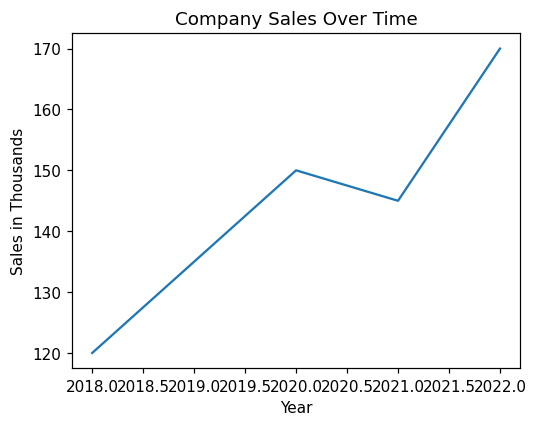

### Bar Plot

A **bar plot** compares the quantities of distinct categories. The function `plt.bar()` draws vertical rectangles, and the `color` argument changes their colour.

```python
import matplotlib.pyplot as plt
products = ['Apples', 'Oranges', 'Bananas']
quantities = [50, 30, 45]
plt.bar(products, quantities, color='orange')
plt.title("Fruit Inventory")
plt.show()
```

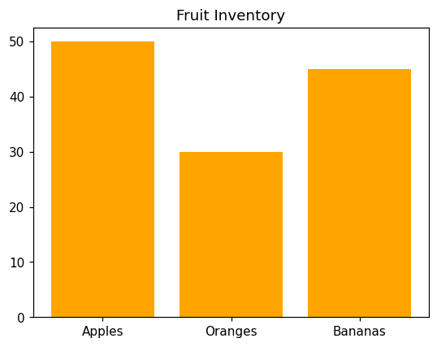

### Pie Chart

A **pie chart** shows how a whole is divided into proportional parts. In `plt.pie()`, the numerical data are given first and the category names are supplied through the `labels` argument. The `autopct='%1.1f%%'` argument tells Python to calculate each slice's percentage and display it to one decimal place.

```python
import matplotlib.pyplot as plt
expenses = ['Rent', 'Food', 'Transport']
costs = [1200, 800, 400]
plt.pie(costs, labels=expenses, autopct='%1.1f%%')
plt.title("Monthly Budget")
plt.show()
```

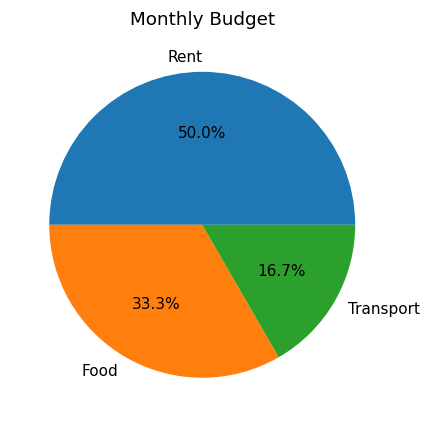

### Histogram

A **histogram** looks like a bar chart but serves a different purpose: it groups a list of numbers into ranges called **bins** and counts how many values fall into each, revealing the distribution of the data. It takes a single list of numbers rather than an x and a y list.

```python
import matplotlib.pyplot as plt
scores = [55, 62, 67, 71, 73, 74, 78, 80, 82, 85, 88, 90, 92, 95]
plt.hist(scores, bins=4, edgecolor='black')
plt.title("Distribution of Exam Scores")
plt.xlabel("Score Ranges")
plt.ylabel("Number of Students")
plt.show()
```

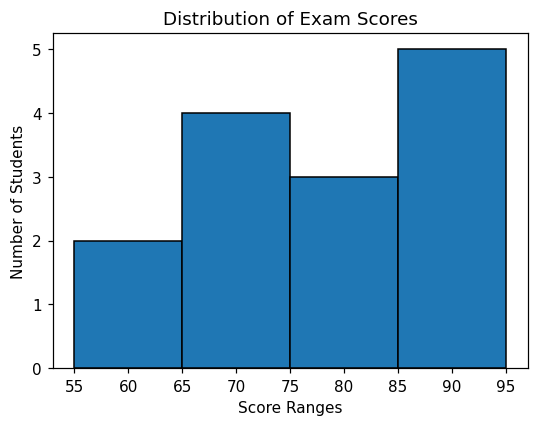

The `bins=4` argument divides the data into four equal ranges, and `edgecolor='black'` draws a border around each bar.

## Preparing the College Data for Plotting

The categorical variables in the College Data (such as `Gender`, `Locality`, and `College`) are stored as numbers. If plotted directly, the charts would show `0` and `1` on the labels, which is confusing. The Pandas `.map()` method replaces these codes with readable text before plotting. It works like a dictionary lookup, scanning a column and replacing each code with its label.

```python
import pandas as pd
import matplotlib.pyplot as plt
cd = pd.read_excel("College Data.xlsx")
cd['Gender'] = cd['Gender'].map({0: 'Male', 1: 'Female'})
cd['Locality'] = cd['Locality'].map({0: 'Urban', 1: 'Rural'})
cd['College'] = cd['College'].map({1: 'College A', 2: 'College B', 3: 'College C'})
```

The examples that follow assume the data has been read and cleaned in this way.

### Pie Chart — Gender Distribution

To chart a category, its values are first counted with `.value_counts()`.

```python
gender_counts = cd['Gender'].value_counts()
plt.pie(gender_counts.values, labels=gender_counts.index, autopct='%1.1f%%', startangle=90)
plt.title("Gender Distribution of PG Students")
plt.show()
```

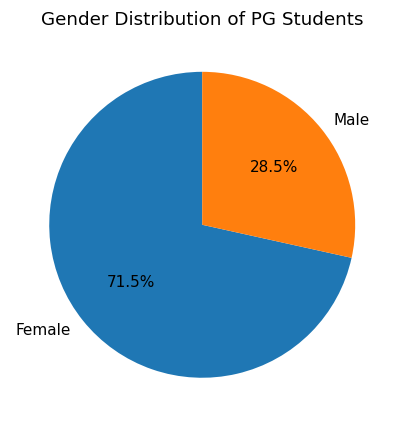

Here `startangle=90` rotates the pie so that it appears upright.

### Bar Plot — Students per College

```python
college_counts = cd['College'].value_counts()
plt.bar(college_counts.index, college_counts.values, color='orange', edgecolor='black')
plt.title("Number of Students in Each College")
plt.xlabel("College Name")
plt.ylabel("Number of Students")
plt.show()
```

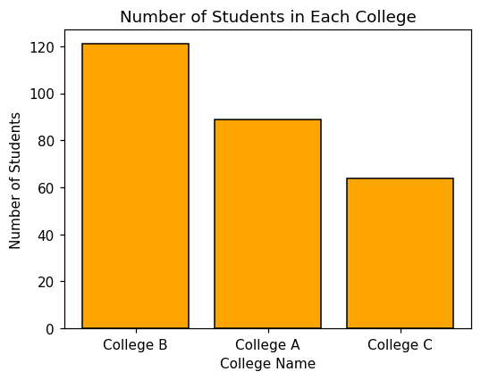

### Histogram — Distribution of Degree Marks

For a histogram the raw column of marks is passed directly, without counting first.

```python
plt.hist(cd['Degree'], bins=10, color='skyblue', edgecolor='black')
plt.title("Distribution of Degree Marks")
plt.xlabel("Percentage of Marks")
plt.ylabel("Number of Students")
plt.show()
```

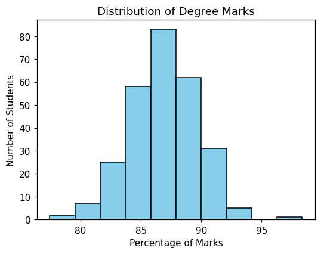

### Line Plot — Average Marks Progression

Although this dataset has no year column, a line plot can show how the average mark changes across the three educational stages SSLC, Plus Two, and Degree.

```python
avg_sslc = cd['SSLC'].mean()
avg_plustwo = cd['PlusTwo'].mean()
avg_degree = cd['Degree'].mean()
education_stages = ['SSLC', 'PlusTwo', 'Degree']
average_marks = [avg_sslc, avg_plustwo, avg_degree]
plt.plot(education_stages, average_marks, marker='o', color='red', linestyle='--')
plt.title("Trend of Average Marks by Education Stage")
plt.xlabel("Education Stage")
plt.ylabel("Average Marks (%)")
plt.grid(True)
plt.show()
```

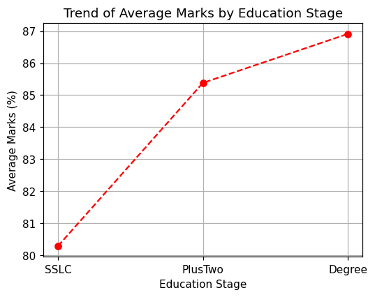

Here `marker='o'` places a dot at each point, `linestyle='--'` makes the line dashed, and `plt.grid(True)` adds a background grid for easier reading.

## Statistical Charts with Seaborn

Seaborn is imported alongside Matplotlib and Pandas. The data is loaded and cleaned in the same way as before.

```python
import pandas as pd
import matplotlib.pyplot as plt
import seaborn as sns
```

### Box Plot

A **box plot** (box-and-whisker plot) displays the distribution of data through a five-number summary: minimum, first quartile, median, third quartile, and maximum. It is the best chart for spotting **outliers**. In Seaborn the categorical variable is given to `x`, the numerical variable to `y`, and the DataFrame to `data`.

```python
sns.boxplot(x='College', y='Degree', data=cd)
plt.title("Box Plot of Degree Marks by College")
plt.xlabel("College Name")
plt.ylabel("Degree Marks (%)")
plt.show()
```

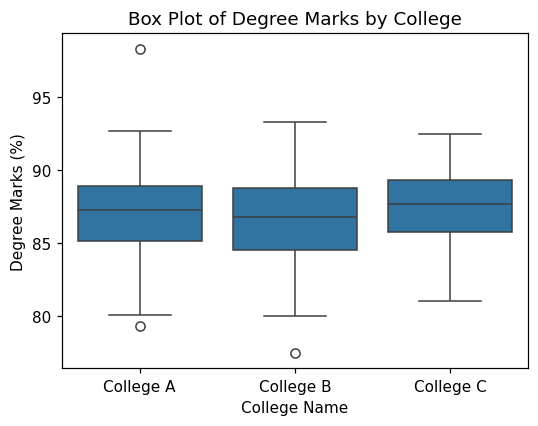

The box represents the middle 50% of students, the line inside it is the median, the whiskers show the rest of the distribution, and any isolated dots beyond the whiskers are outliers.

### Strip Plot

A **strip plot** is a scatter plot in which one axis represents categories. The `jitter=True` argument spreads overlapping points slightly sideways so that individual points remain visible even when several students share the same mark.

```python
sns.stripplot(x='Gender', y='PlusTwo', data=cd, jitter=True)
plt.title("Strip Plot of PlusTwo Marks by Gender")
plt.xlabel("Student Gender")
plt.ylabel("PlusTwo Marks (%)")
plt.show()
```

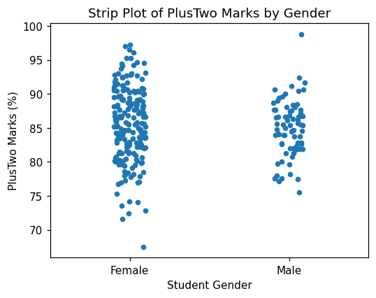

### Swarm Plot

Even with jitter, a strip plot can look crowded. A **swarm plot** positions every point so that none overlap, producing a shape resembling a swarm of bees; its width shows where the data is most dense.

```python
sns.swarmplot(x='Locality', y='SSLC', data=cd)
plt.title("Swarm Plot of SSLC Marks by Locality")
plt.xlabel("Student Locality")
plt.ylabel("SSLC Marks (%)")
plt.show()
```

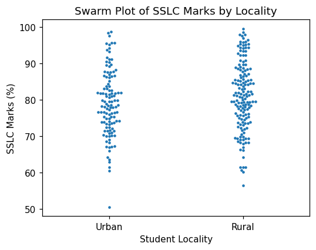

## Advanced Plots

### Scatter Plot

A **scatter plot** shows the relationship between two numerical variables. Here it is used to see whether students who scored well in Plus Two also scored well in their Degree.

```python
plt.scatter(cd['PlusTwo'], cd['Degree'])
plt.xlabel("PlusTwo Marks (%)")
plt.ylabel("Degree Marks (%)")
plt.title("Scatter Plot of PlusTwo vs Degree Marks")
plt.show()
```

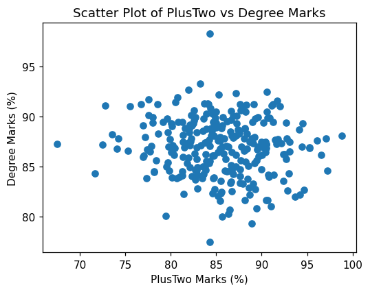

The same relationship can be drawn interactively with **Plotly**, or layer by layer with **ggplot**:

```python
# Interactive scatter plot with Plotly (displays inside Colab)
from plotly.offline import init_notebook_mode, iplot
import plotly.graph_objs as go
init_notebook_mode(connected=True)
trace = go.Scatter(x=cd['PlusTwo'], y=cd['Degree'], mode='markers')
iplot([trace])
```

```python
# Scatter plot with ggplot (requires: pip install ggplot)
from ggplot import *
p = ggplot(aes(x='PlusTwo', y='Degree', color='Gender'), data=cd)
p + geom_point() + ggtitle("PlusTwo vs Degree Marks")
```

In the Plotly code, `mode='markers'` draws dots rather than a line, and `iplot()` produces an interactive chart on which values appear when the mouse hovers over a point. In the ggplot code, `aes()` maps the axes and colour, and `geom_point()` adds the layer of dots.

### Heatmap

A **heatmap** uses colour to show the intensity of the numbers in a two-dimensional matrix. It is an excellent way to display the correlation between variables. The Pandas `.corr()` method computes the correlations first.

```python
correlations = cd[['SSLC', 'PlusTwo', 'Degree']].corr()
sns.heatmap(correlations, annot=True, cmap='coolwarm')
plt.title("Correlation Heatmap of Student Marks")
plt.show()
```

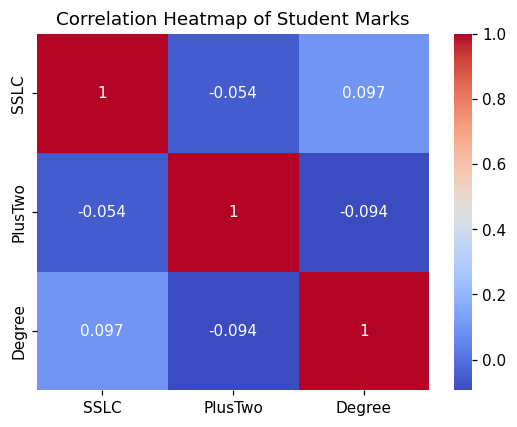

The argument `annot=True` writes the correlation values inside the coloured cells, and `cmap='coolwarm'` shades high values red and low values blue.

### Density Plot and Cumulative Frequency

A **density plot** is a smoothed version of a histogram showing the shape of the data, and can be drawn directly from a Pandas column. A **cumulative-frequency** plot shows a running total, obtained by adding `cumulative=True` to a histogram.

```python
# Density plot using Pandas directly
cd['Degree'].plot.density(color='purple', linewidth=3)
plt.title("Density Plot of Degree Marks")
plt.xlabel("Marks (%)")
plt.show()
```

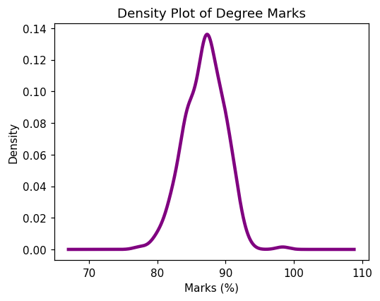

```python
# Cumulative frequency using Matplotlib
plt.hist(cd['Degree'], bins=20, cumulative=True, color='orange', edgecolor='black')
plt.title("Cumulative Frequency of Degree Marks")
plt.xlabel("Marks (%)")
plt.ylabel("Running Total of Students")
plt.show()
```

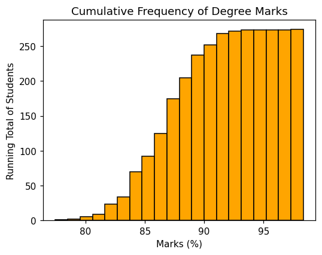

### Error Bars

An **error bar** is a line drawn through a data point to represent uncertainty or variation. Here the average Degree mark for each college is plotted, with error bars showing the standard deviation.

```python
avg_marks = cd.groupby('College')['Degree'].mean()
std_marks = cd.groupby('College')['Degree'].std()
plt.bar(avg_marks.index, avg_marks.values, yerr=std_marks.values,
        capsize=5, color='lightblue', edgecolor='black')
plt.title("Average Degree Marks per College with Error Bars")
plt.ylabel("Average Marks (%)")
plt.show()
```

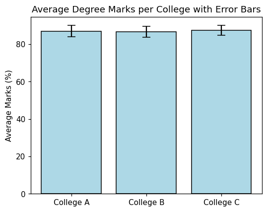

The `.groupby()` method finds the mean and standard deviation for each college. The argument `yerr=std_marks.values` draws the vertical error lines, and `capsize=5` adds small horizontal caps at their ends.

## Practice Exercises {-}

::: {.practice}
**Exercise 3.1 — A Line Plot.** Heart rate was recorded each hour for four hours as `[72, 75, 78, 74]` at hours `[1, 2, 3, 4]`. Draw a line plot of this data with a title.

**Exercise 3.2 — A Bar Plot.** Three departments `['IT', 'HR', 'Sales']` have `[10, 6, 14]` employees. Draw a green bar plot comparing them.

**Exercise 3.3 — A Histogram.** Using the College Data, draw a histogram of the `SSLC` column with 20 bins and a black edge colour.

**Exercise 3.4 — A Box Plot.** Using the College Data, draw a Seaborn box plot of `Degree` marks grouped by `Gender`.
:::
