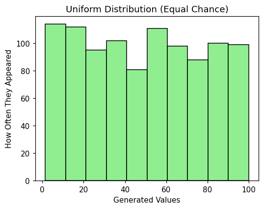
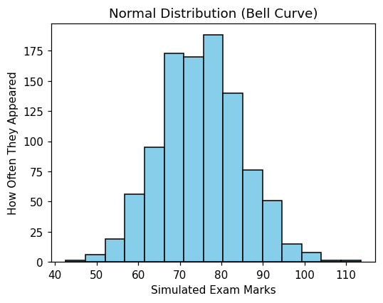
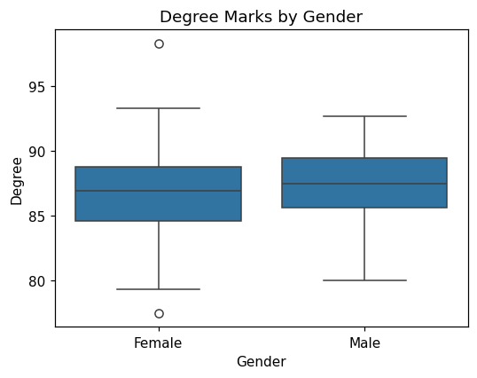
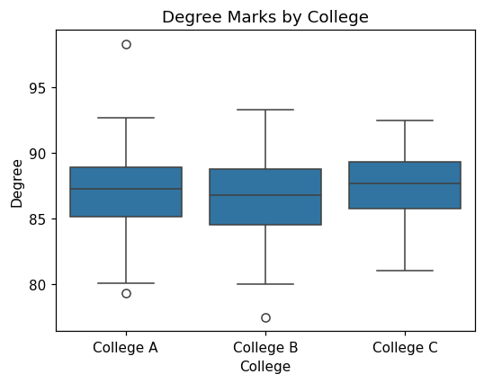
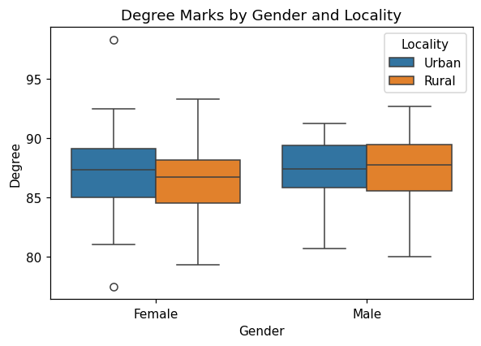
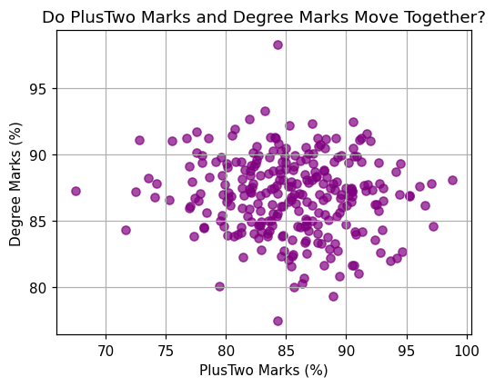
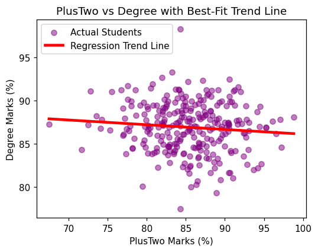
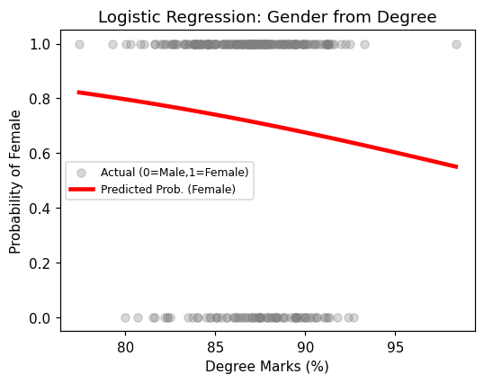

# Statistical Data Analysis {#stats}

::: {.objectives}
**Learning Objectives**

After studying this chapter, a student will be able to:

- generate simulated data from the uniform and normal distributions;
- explain hypothesis testing using the null and alternative hypotheses and the p-value;
- test whether data is normally distributed using the Shapiro–Wilk test;
- carry out one-sample, two-sample (independent), and paired tests, choosing a parametric or non-parametric test as appropriate;
- carry out one-way and two-way ANOVA to compare three or more groups;
- measure the relationship between two numerical variables using correlation; and
- build and interpret simple linear, multiple linear, and logistic regression models.
:::

This chapter uses the **statsmodels** and **scipy** libraries for statistical testing, together with **numpy** for generating data. All examples use the course dataset, `College_Data.csv`. Rather than treating statistics as a branch of mathematics, this chapter treats it as a logical way of using data to answer real questions.

## Generating Simulated Data

Sometimes we do not yet have real data but want to imagine, or **simulate**, a situation. For this we use the **numpy** library, conventionally imported as `np`. Two ways in which data can be spread out are especially important: the uniform distribution and the normal distribution.

### The Uniform Distribution

In a **uniform distribution** every value in a range has an equal chance of being chosen, like rolling a fair die where each of the six faces is equally likely.

```python
import numpy as np
import matplotlib.pyplot as plt

# Generate 1,000 random decimal numbers between 1 and 100
uniform_scores = np.random.uniform(low=1.0, high=100.0, size=1000)

plt.hist(uniform_scores, bins=10, color='lightgreen', edgecolor='black')
plt.title("Uniform Distribution (Equal Chance)")
plt.xlabel("Generated Values")
plt.ylabel("How Often They Appeared")
plt.show()
```



The function `np.random.uniform(low=1.0, high=100.0, size=1000)` asks Python to generate 1,000 numbers between 1 and 100, each equally likely. Because every value is equally likely, the bars of the histogram are all roughly the same height, giving a flat shape.

### The Normal Distribution

In real life, quantities such as height, weight, or exam marks are not equally likely. Most people cluster near the average, and very few are extremely high or extremely low. This forms a symmetrical **bell curve**, called the **normal distribution**.

```python
import numpy as np
import matplotlib.pyplot as plt

# Lock the random numbers so they are the same every time
np.random.seed(42)

# Generate 1,000 scores with an average of 75 and a spread of 10
bell_curve_scores = np.random.normal(loc=75.0, scale=10.0, size=1000)

plt.hist(bell_curve_scores, bins=15, color='skyblue', edgecolor='black')
plt.title("Normal Distribution (Bell Curve)")
plt.xlabel("Simulated Exam Marks")
plt.ylabel("How Often They Appeared")
plt.show()
```



Two details are worth noting. `np.random.seed(42)` fixes the starting point of the random-number generator, so that the same numbers are produced every time the code is run — useful when everyone in a class should get identical results. In `np.random.normal(loc=75.0, scale=10.0, size=1000)`, `loc` is the average (mean) around which the numbers cluster, and `scale` is the standard deviation, which controls how spread out they are. The peak of the resulting hill sits at 75, showing that most simulated students scored near the average.

## Hypothesis Testing: The Courtroom Analogy

Most statistical questions are answered by **hypothesis testing**. The logic is exactly like a criminal trial.

A **hypothesis** is an educated guess. Every test involves two competing hypotheses:

- The **null hypothesis** ($H_0$) is the *innocent defendant*. It is the default assumption that nothing special is happening: there is no real difference or effect, and any pattern we see is just coincidence.
- The **alternative hypothesis** ($H_1$) is the *prosecutor's claim*. It states that something real is happening: a genuine difference or effect exists.

Our **data** is the evidence presented at the trial.

The **p-value** is the "doubt meter". It measures the probability of seeing evidence like ours purely by chance, *if the defendant were actually innocent* (that is, if $H_0$ were true). The standard threshold is $\alpha = 0.05$, which plays the role of "beyond reasonable doubt":

- If **p < 0.05** (low doubt): the chance that this happened by pure coincidence is less than 5%. We **reject** $H_0$ and conclude $H_1$ — something real is happening.
- If **p ≥ 0.05** (high doubt): there is too much doubt to convict. We **accept** $H_0$ — there is not enough evidence of a real effect.

This single rule — compare the p-value to 0.05 — is used in every test in this chapter.

## Checking for Normality: The Gatekeeper

Before choosing a test, we must run a diagnostic check on our data: does the column of numbers follow a normal bell curve or not? The answer decides which kind of test we may use.

- If the data **is** normal, we use precise tools called **parametric tests**.
- If the data is **not** normal, we use sturdier backup tools called **non-parametric tests**.

The standard check is the **Shapiro–Wilk test**. Set up as a courtroom trial:

- $H_0$ (innocent): the data *is* normally distributed.
- $H_1$ (guilty): the data is *not* normally distributed.

```python
import pandas as pd
import scipy.stats as stats

df = pd.read_excel('college_data.xlsx')

# Run the Shapiro-Wilk test on the Degree marks
stat, p_value = stats.shapiro(df['Degree'])
print("Normality Test Result:")
print("p-value:", p_value)
```

The function `stats.shapiro(df['Degree'])` returns two numbers: a test statistic and a p-value. We store the p-value and read it using the standard rule. If the p-value is **greater than 0.05**, we accept $H_0$: the data is normal, and a parametric test may be used. If it is **less than 0.05**, we reject $H_0$: the data is not normal, and a non-parametric test is required.

Note the way the two returned values are captured: writing `stat, p_value = stats.shapiro(...)` unpacks them into two separate variables, so that the p-value can be printed or formatted on its own.

## One-Sample Tests

A **one-sample test** compares the average of a single group against a fixed number. Consider the question: *"Is the average Degree mark in our college equal to 86%?"*

- $H_0$: the average Degree mark is equal to 86%.
- $H_1$: the average Degree mark is not equal to 86%.

Which test we use depends on the normality check from the previous section.

::: {.worked}
**Worked Example 4.1 — One-Sample t-test (data is normal)**

If the Shapiro–Wilk p-value for `Degree` was greater than 0.05, the data is normal and we use the parametric **one-sample t-test**.

```python
t_stat, p_val = stats.ttest_1samp(df['Degree'], popmean=86.0)
print("t-test Result:")
print("p-value:", p_val)
```

`stats.ttest_1samp(df['Degree'], popmean=86.0)` checks whether the average of the Degree column is close enough to the hypothesised value 86.0. If `p_val` is less than 0.05, we reject $H_0$ and conclude the average is *not* 86%. If it is greater than 0.05, we accept $H_0$ and conclude the average *is* 86%.
:::

::: {.worked}
**Worked Example 4.2 — Wilcoxon Signed-Rank test (data is not normal)**

If the normality p-value was below 0.05, the data is skewed and the t-test cannot be trusted. We use the non-parametric **Wilcoxon signed-rank test**, which works on the median instead of the mean.

- $H_0$: the median Degree mark is equal to 86%.
- $H_1$: the median Degree mark is not equal to 86%.

The Wilcoxon test needs the hypothesised value subtracted from the column first.

```python
# Subtract the hypothesised value from the column
difference_from_hypothesised = df['Degree'] - 86.0

wilc_stat, p_val = stats.wilcoxon(difference_from_hypothesised)
print("Wilcoxon Test Result:")
print("p-value:", p_val)
```

As always, if `p_val` is less than 0.05 we reject $H_0$ and conclude the marks differ significantly from 86%.
:::

## Two-Sample Tests: Comparing Two Separate Groups

A **two-sample (independent) test** compares two completely separate groups. Consider: *"Do male and female students get different average Degree marks?"*

It helps to look at a boxplot first, to form a visual expectation. If the two boxes sit at clearly different heights, we expect a low p-value; if they overlap heavily, we expect a high one.

```python
import pandas as pd
import scipy.stats as stats
import seaborn as sns
import matplotlib.pyplot as plt

df = pd.read_excel('college_data.xlsx')
df['Gender'] = df['Gender'].map({0: 'Male', 1: 'Female'})

sns.boxplot(x='Gender', y='Degree', data=df)
plt.title("Degree Marks by Gender")
plt.show()
```



Next we check normality for **each** group separately, then choose the test.

```python
males = df[df['Gender'] == 'Male']['Degree']
females = df[df['Gender'] == 'Female']['Degree']

_, p_male = stats.shapiro(males)
_, p_female = stats.shapiro(females)
print(f"Male Normality p-value: {p_male:.4f}")
print(f"Female Normality p-value: {p_female:.4f}")
```

Here `df[df['Gender'] == 'Male']['Degree']` picks out just the Degree marks of the male students, and similarly for females. The underscore in `_, p_male = stats.shapiro(males)` is a placeholder that discards the test statistic, keeping only the p-value.

This is the **fork in the road**:

- If **both** p-values are above 0.05, both groups are normal, and we use the parametric **independent t-test**.
- If **either** p-value is below 0.05, we use the non-parametric **Mann–Whitney U test**.

```python
# If both groups are normal: independent t-test
t_stat, p_val_t = stats.ttest_ind(males, females)
print(f"t-test p-value: {p_val_t:.4f}")

# If the data is skewed: Mann-Whitney U test
u_stat, p_val_u = stats.mannwhitneyu(males, females)
print(f"Mann-Whitney p-value: {p_val_u:.4f}")
```

`stats.ttest_ind(males, females)` compares the two averages; `stats.mannwhitneyu(males, females)` does the same job using ranks rather than averages, which is why it is safe for skewed data. Whichever test is appropriate, the decision rule is unchanged: p below 0.05 means a significant difference.

## Paired Tests: Comparing the Same People Twice

A **paired test** compares the *same* individuals measured at two different times, rather than two separate groups. Consider: *"Did students' marks change significantly from PlusTwo to Degree?"* Because each student appears in both columns, the two measurements are locked together in pairs.

For a paired test there is an important difference in the normality check: we do **not** test each column separately. Instead we test the normality of the **difference** between the two columns. Throughout this section the difference is taken as *later minus earlier*, so a positive difference means improvement.

```python
# Check the normality of the DIFFERENCE between the two scores
differences = df['Degree'] - df['PlusTwo']
_, p_norm = stats.shapiro(differences)
print(f"Differences Normality p-value: {p_norm:.4f}")
```

Then the appropriate paired test is chosen:

```python
# If the differences are normal: paired t-test
t_paired, p_paired = stats.ttest_rel(df['Degree'], df['PlusTwo'])
print(f"Paired t-test p-value: {p_paired:.4f}")

# If the differences are not normal: Wilcoxon signed-rank test
wilc_stat, p_wilc = stats.wilcoxon(df['Degree'], df['PlusTwo'])
print(f"Wilcoxon Paired p-value: {p_wilc:.4f}")
```

`stats.ttest_rel()` stands for "related t-test"; it pairs the first Degree mark with the first PlusTwo mark, the second with the second, and so on. `stats.wilcoxon()` is its non-parametric backup. To keep the direction consistent with the normality check, the columns are listed in the same order (`Degree` first, `PlusTwo` second).

## Comparing Three or More Groups: ANOVA

When there are three or more groups, running many two-sample t-tests is poor practice, because each extra test raises the chance of a false positive. Instead we use **ANOVA (Analysis of Variance)**, which compares all the groups at once. Intuitively, ANOVA checks whether the differences *between* the groups are much larger than the natural variation *inside* each group.

### One-Way ANOVA

**One-way ANOVA** compares groups defined by a single factor. Consider: *"Do students from College A, College B, and College C get different Degree marks?"*

```python
import pandas as pd
import scipy.stats as stats
import seaborn as sns
import matplotlib.pyplot as plt

df = pd.read_excel('college_data.xlsx')
df['College'] = df['College'].map({1: 'College A', 2: 'College B', 3: 'College C'})

sns.boxplot(x='College', y='Degree', data=df)
plt.title("Degree Marks by College")
plt.show()

# Separate the data into three groups
g_a = df[df['College'] == 'College A']['Degree']
g_b = df[df['College'] == 'College B']['Degree']
g_c = df[df['College'] == 'College C']['Degree']

# Check normality for all three groups
_, p_a = stats.shapiro(g_a)
_, p_b = stats.shapiro(g_b)
_, p_c = stats.shapiro(g_c)
print(f"College A: {p_a:.4f}")
print(f"College B: {p_b:.4f}")
print(f"College C: {p_c:.4f}")
```



Note that each Shapiro–Wilk result is unpacked into its own p-value (`_, p_a = stats.shapiro(g_a)`) before formatting, since the test returns two values and only the p-value is needed. The fork is the same as before:

```python
# If all groups are normal: one-way ANOVA
f_val, p_anova = stats.f_oneway(g_a, g_b, g_c)
print(f"One-way ANOVA p-value: {p_anova:.4f}")

# If at least one group is not normal: Kruskal-Wallis test
h_val, p_kruskal = stats.kruskal(g_a, g_b, g_c)
print(f"Kruskal-Wallis p-value: {p_kruskal:.4f}")
```

`stats.f_oneway()` is the parametric one-way ANOVA; `stats.kruskal()` is its non-parametric equivalent, the three-or-more-group version of the Mann–Whitney U test. A p-value below 0.05 means at least one college differs significantly from the others.

### Two-Way ANOVA

**Two-way ANOVA** examines *two* factors at the same time, and also whether they interact. Consider: *"Does the Degree mark depend on Gender and on Locality, and do the two factors combine in any special way?"* For this we use the **statsmodels** library, which can fit a model with more than one factor.

```python
import statsmodels.api as sm
import statsmodels.formula.api as smf

df = pd.read_excel('college_data.xlsx')
df['Gender'] = df['Gender'].map({0: 'Male', 1: 'Female'})
df['Locality'] = df['Locality'].map({0: 'Urban', 1: 'Rural'})

sns.boxplot(x='Gender', y='Degree', hue='Locality', data=df)
plt.title("Degree Marks by Gender and Locality")
plt.show()

# Fit a two-way model: Degree explained by Gender and Locality
model = smf.ols('Degree ~ C(Gender) + C(Locality)', data=df).fit()

# Produce the ANOVA table
anova_table = sm.stats.anova_lm(model, typ=2)
print(anova_table)
```



In the formula `'Degree ~ C(Gender) + C(Locality)'`, the part before the tilde (`~`) is the quantity being explained (Degree), and the parts after it are the two factors. Wrapping each factor in `C(...)` tells statsmodels to treat it as a category rather than a number. The function `anova_lm` then prints a table with one row per factor, each with its own p-value. Reading is exactly as before: a factor whose p-value is below 0.05 has a significant effect on the Degree mark.

## Correlation

**Correlation** measures how strongly two numerical columns move together. It is summarised by a single number, the correlation coefficient $r$, which always lies between $-1$ and $+1$:

- **Positive** ($r$ near $+1$): as one value rises, the other rises too (for example, hours studied and exam score).
- **Negative** ($r$ near $-1$): as one rises, the other falls (for example, hours spent gaming and exam score).
- **Zero** ($r$ near $0$): there is no relationship (for example, shoe size and exam score).

Before calculating anything, it is best to look at a **scatter plot**.

```python
import pandas as pd
import matplotlib.pyplot as plt

df = pd.read_excel('college_data.xlsx')

plt.scatter(df['PlusTwo'], df['Degree'], color='purple', alpha=0.7)
plt.title("Do PlusTwo Marks and Degree Marks Move Together?")
plt.xlabel("PlusTwo Marks (%)")
plt.ylabel("Degree Marks (%)")
plt.grid(True)
plt.show()
```



Pandas can compute the correlation between several columns at once with the `.corr()` method.

```python
correlation_matrix = df[['SSLC', 'PlusTwo', 'Degree']].corr()
print("Correlation Table (r-values):")
print(correlation_matrix)
```

The result is a grid showing how each column correlates with every other column. Every column always has a correlation of exactly $1.0$ with itself, along the diagonal. To read any other cell, look at the number: a value near $+1$ is a strong positive connection, a value near $-1$ a strong negative connection, and a value near $0$ means the two marks are essentially unrelated.

## Simple Linear Regression

Correlation tells us *whether* two variables are related. **Regression** goes further and gives an actual equation to **predict** one variable from another. Just as one might predict a house's price from its size by drawing a straight trend line through past sales, regression finds the exact equation of that line:
$$\text{Degree Mark} = (\text{Slope} \times \text{PlusTwo Mark}) + \text{Starting Point}.$$

The **slope** says how much the Degree mark is predicted to rise for each one-percent rise in PlusTwo, and the **starting point** (intercept) is the predicted Degree mark for a student who scored zero in PlusTwo. We fit the model with **statsmodels**.

```python
import statsmodels.formula.api as smf

# Predict 'Degree' (dependent) from 'PlusTwo' (independent)
model = smf.ols('Degree ~ PlusTwo', data=df).fit()

print(model.summary())
```

The `summary()` output is a large table, but a beginner needs only three values from it:

1. **R-squared** (top right) is the model's accuracy score. An R-squared of 0.64 would mean the model explains 64% of the variation in Degree marks; higher is better.
2. The **Intercept** coefficient is the starting point. If it reads 15.2, a student with 0% in PlusTwo is predicted to score 15.2% in Degree.
3. The **PlusTwo** coefficient is the slope. If it reads 0.85, then for every 1% rise in PlusTwo the predicted Degree mark rises by 0.85%.

The fitted line can be drawn on top of the scatter plot.

```python
plt.scatter(df['PlusTwo'], df['Degree'], color='purple', alpha=0.5, label='Actual Students')

predicted_degree = model.predict(df['PlusTwo'])
plt.plot(df['PlusTwo'], predicted_degree, color='red', linewidth=3, label='Regression Trend Line')

plt.title("PlusTwo vs Degree with Best-Fit Trend Line")
plt.xlabel("PlusTwo Marks (%)")
plt.ylabel("Degree Marks (%)")
plt.legend()
plt.show()
```



`model.predict(df['PlusTwo'])` uses the fitted equation to compute a predicted Degree mark for every student, and these predictions, joined together, form the straight red trend line.

## Multiple Linear Regression

**Multiple linear regression** predicts one variable from **two or more** predictors at once. For example, we may predict a student's Degree mark from *both* their SSLC and PlusTwo marks together. The only change is that the formula lists more than one predictor, joined by a plus sign.

```python
import statsmodels.formula.api as smf

# Predict Degree from BOTH SSLC and PlusTwo
model = smf.ols('Degree ~ SSLC + PlusTwo', data=df).fit()
print(model.summary())
```

The summary is read in the same way as before, with one extension: there is now a separate slope coefficient for **each** predictor. The SSLC coefficient shows how much the predicted Degree mark changes for each one-percent rise in SSLC *while PlusTwo is held fixed*, and the PlusTwo coefficient does the same for PlusTwo. The R-squared again reports the overall accuracy, now using both predictors together.

## Logistic Regression

All the regressions so far predict a **number**. **Logistic regression** is used when the outcome is a **yes/no** category instead — for example, predicting whether a student is Female or Male. Instead of a number, it predicts a **probability** between 0 and 1.

Because Gender is already stored as 0 for Male and 1 for Female, it can be used directly as the yes/no outcome. Consider predicting Gender (Female or not) from the Degree mark.

```python
import statsmodels.formula.api as smf

# Predict the yes/no outcome 'Gender' (1 = Female) from Degree marks
model = smf.logit('Gender ~ Degree', data=df).fit()
print(model.summary())
```

The function used is `smf.logit()` rather than `smf.ols()`, because the outcome is a category rather than a number. The output is read more simply here: look at the **sign** of the Degree coefficient. A **positive** coefficient means that as the Degree mark rises, the probability of the outcome (being Female) rises; a **negative** coefficient means the probability falls. The predicted probabilities trace out a smooth S-shaped curve rather than a straight line.

```python
import numpy as np

# Predicted probability across the range of Degree marks
xs = np.linspace(df['Degree'].min(), df['Degree'].max(), 200)
predicted_prob = model.predict(pd.DataFrame({'Degree': xs}))

plt.scatter(df['Degree'], df['Gender'], alpha=0.3, color='gray', label='Actual (0=Male, 1=Female)')
plt.plot(xs, predicted_prob, color='red', linewidth=3, label='Predicted Probability (Female)')
plt.title("Logistic Regression: Predicting Gender from Degree")
plt.xlabel("Degree Marks (%)")
plt.ylabel("Probability of Female")
plt.legend()
plt.show()
```



The grey dots at heights 0 and 1 are the actual students (Male at 0, Female at 1), and the red S-shaped curve gives the model's predicted probability of being Female at each Degree mark.

## Practice Exercises {-}

::: {.practice}
**Exercise 4.1 — Check Normality of PlusTwo.** Load the college data and run a Shapiro–Wilk test on the `PlusTwo` column. Print the p-value and state, using the 0.05 rule, whether the data is normal.

**Exercise 4.2 — One-Sample Test.** Using the result of Exercise 4.1, test whether the average `PlusTwo` mark is equal to 85%. Run the correct test (one-sample t-test if normal, Wilcoxon if not) and give your conclusion.

**Exercise 4.3 — Two Groups.** Map `Locality` to `'Urban'` and `'Rural'`, separate the `SSLC` marks for the two groups, check their normality, and run the appropriate two-sample test (independent t-test or Mann–Whitney U). Print the p-value.

**Exercise 4.4 — Three or More Groups.** Separate the `Degree` scores by the four `Income` levels (0, 1, 2, 3) and run a Kruskal–Wallis test (`stats.kruskal`) to compare all four groups at once.

**Exercise 4.5 — Correlation and Regression.** Draw a scatter plot of `SSLC` (x-axis) against `PlusTwo` (y-axis), compute the correlation between them with `df['SSLC'].corr(df['PlusTwo'])`, then fit a simple linear regression `smf.ols('PlusTwo ~ SSLC', data=df).fit()` and note the R-squared value from the summary.
:::
